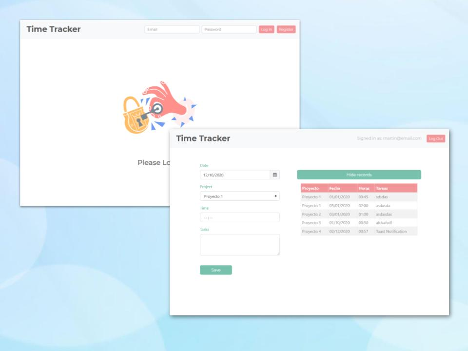

# Time Tracker React App



[Demo](https://time-tracker-ghtq4byho.vercel.app/)

⏳ Time Tracker

* 📧 Login/Sign up with email
​
* 📦 Track several proyects
​
* 📝 Traking History (Real time database)


## Technologies used:

* ReactJS
* Html, css
* Firebase
* Bootstrap


## Installation

In the project directory, you can run: 

```bash
yarn start
```
 or

```bash
npm start
```
You also need your own <strong>Firebase account and api key </strong><br />

Runs the app in the development mode. <br />
Open [http://localhost:3000](http://localhost:3000) to view it in the browser.

The page will reload if you make edits.<br />
You will also see any lint errors in the console.


